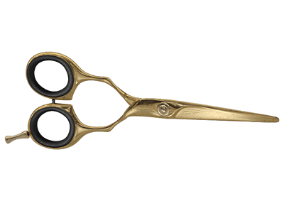
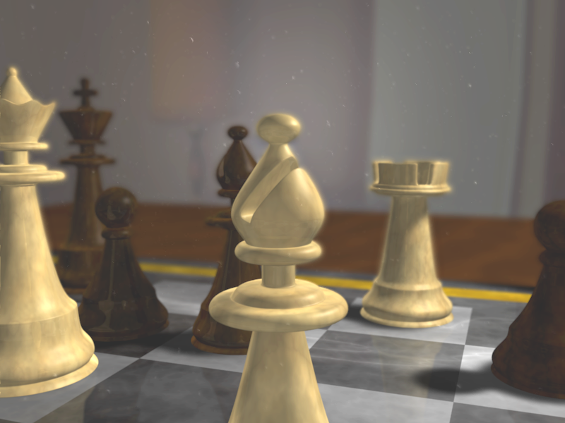
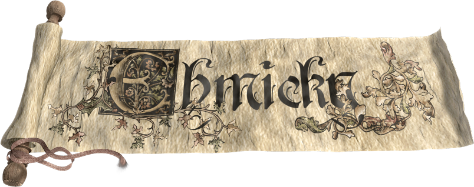
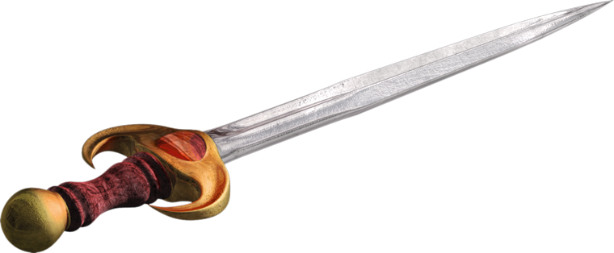
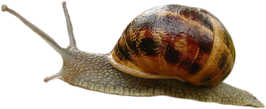
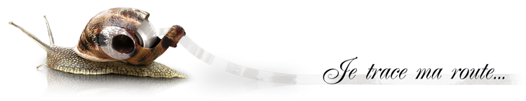
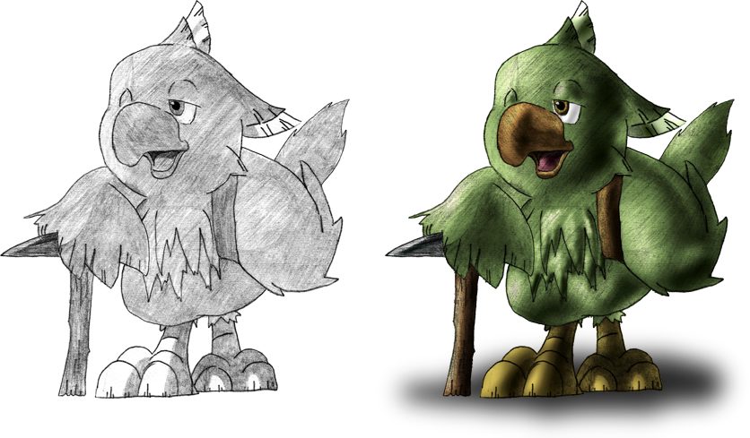
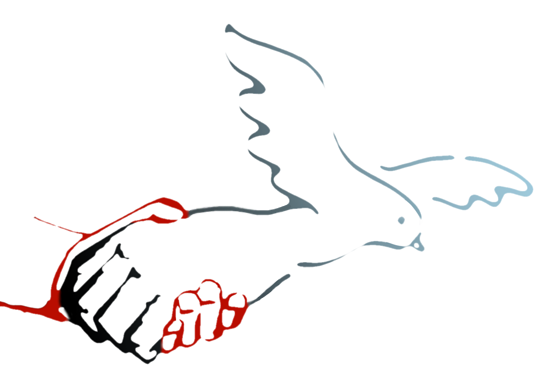

Examples of digital art. Those were done in my spare time, as a humble amateur, and are far from matching the level of a professional artist. However, I have lots of fun creating those!

## 3D

Created with Blender and Photoshop.

## Image editing

Created with Photoshop.

## Drawing

Created with Illustrator and Photoshop.

## Video editing

Created with After Effects.

[Video](light.wmv) of a light travelling with some music.

## Logos

Created with Gimp and Inkscape. Please see the [following repository](https://github.com/ehmicky/design) for more logos.

<picture>
  <source media="(prefers-color-scheme: dark)" srcset="https://raw.githubusercontent.com/ehmicky/design/main/handle-cli-error/handle-cli-error_dark.svg"/>
  
</picture>
